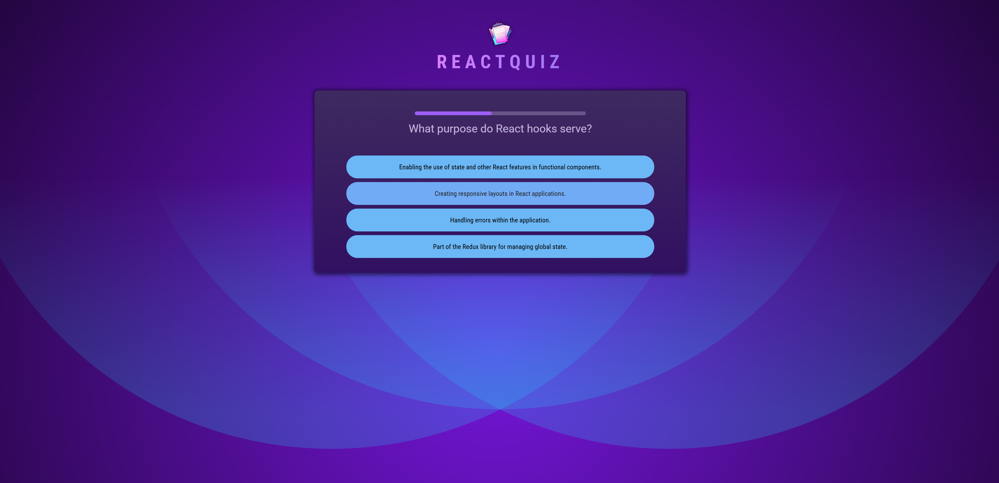
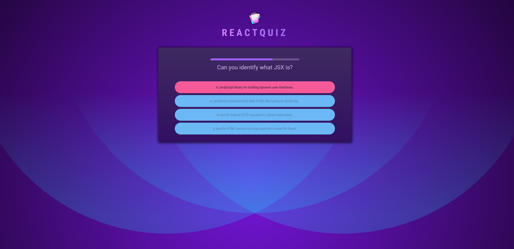
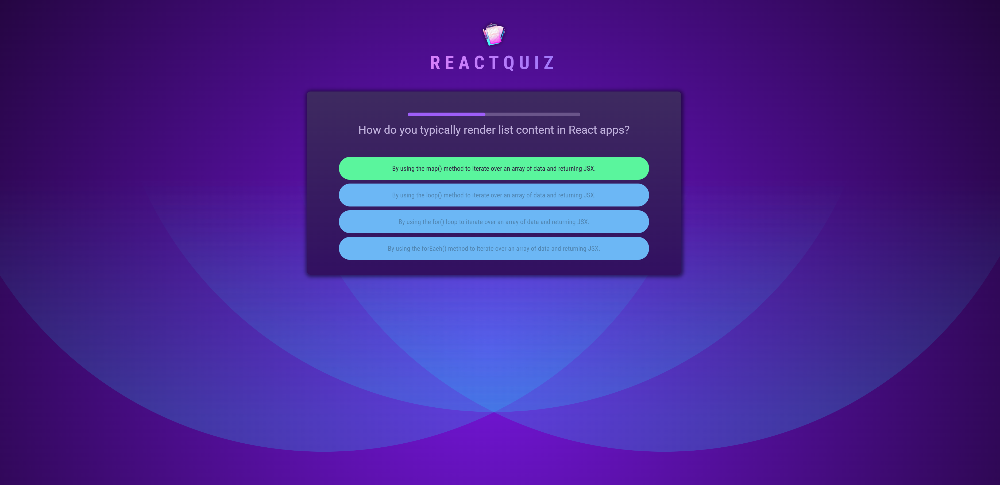
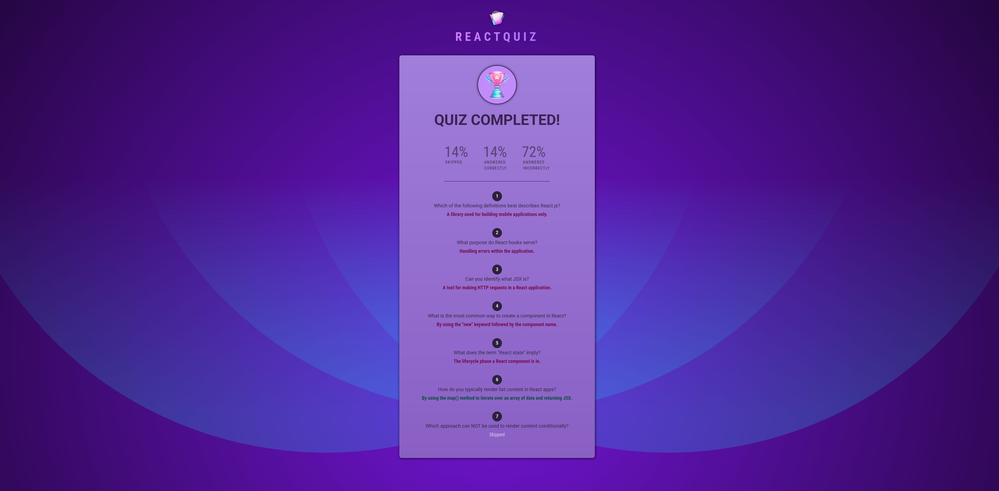

# React 퀴즈 앱 - 리액트 학습 프로젝트

React의 핵심 개념들을 학습하기 위한 대화형 퀴즈 애플리케이션입니다.

## 프로젝트 스크린샷


  



## 📚 학습한 React 개념들

### 1. 함수형 컴포넌트와 JSX

- React 함수형 컴포넌트 작성법
- JSX 문법과 컴포넌트 구조
- Props를 통한 데이터 전달

### 2. React Hooks

- **useState**: 컴포넌트 상태 관리

  - 퀴즈 진행 상태 관리
  - 사용자 답변 저장
  - 타이머 상태 관리

- **useEffect**: 생명주기와 사이드 이펙트 처리

  - 타이머 설정 및 정리
  - 컴포넌트 마운트/언마운트 시 로직 실행

- **useCallback**: 함수 메모이제이션
  - 성능 최적화를 위한 콜백 함수 메모이제이션
  - 불필요한 리렌더링 방지

### 3. 컴포넌트 구조와 재사용성

- **Header**: 애플리케이션 헤더 컴포넌트
- **Quiz**: 메인 퀴즈 로직 컴포넌트
- **Question**: 개별 질문 표시 컴포넌트
- **Answers**: 답변 선택지 컴포넌트
- **QuestionTimer**: 진행률 표시 타이머 컴포넌트
- **Summary**: 결과 요약 컴포넌트

### 4. 상태 관리 패턴

- 상위 컴포넌트에서 하위 컴포넌트로 상태 전달
- 이벤트 핸들링을 통한 상태 업데이트
- 조건부 렌더링 (퀴즈 진행 중 vs 완료)

### 5. 고급 React 개념들

- **Key Props**: 리스트 렌더링 시 고유 키 사용
- **조건부 렌더링**: 삼항 연산자와 논리 연산자 활용
- **배열 메서드**: `map()`, `filter()` 등을 활용한 데이터 처리
- **타이머 관리**: `setTimeout`과 `setInterval` 정리

### 6. CSS 클래스 동적 적용

- 답변 상태에 따른 동적 스타일링
- 조건부 CSS 클래스 적용

## 🎯 주요 기능

1. **대화형 퀴즈**: React 관련 7개 문제
2. **타이머 기능**: 각 질문당 10초 제한시간
3. **즉시 피드백**: 답변 후 정답/오답 표시
4. **진행률 표시**: 시각적 진행률 바
5. **결과 요약**: 정답률, 건너뛴 문제, 오답 통계
6. **상세 리뷰**: 모든 질문과 사용자 답변 검토

## 🚀 실행 방법

```bash
# 의존성 설치
npm install

# 개발 서버 실행
npm run dev

# 빌드
npm run build
```

## 📖 학습 포인트

- 컴포넌트 기반 아키텍처 설계
- 상태 관리 최적화 기법
- 사용자 인터랙션 처리
- 타이머와 비동기 처리
- 성능 최적화 (`useCallback` 활용)
- 조건부 렌더링과 동적 스타일링
